<!---
GeneYP/GeneYP is a ✨ special ✨ repository because its `README.md` (this file) appears on your GitHub profile.
You can click the Preview link to take a look at your changes.
--->
## About Me
### Hello there! 👋( ´▽｀)

I’m [@GeneYP](https://github.com/GeneYP/), a rookie programmer from China.

- 🔭 Major in software engineering. o(｀ω´ )o
- 👀 I’m interested in furries, guitar, fitness ...
- 🌱 Amateur for rhythm game. (￣▽￣)
- 💬 Personal Blog: https://www.gene-yp.com/ 

<!-- ## My Works
 -->

## Github Metrics

<!--

Here are some ideas to get you started:

- 🔭 I’m currently working on ...
- 🌱 I’m currently learning ...
- 👯 I’m looking to collaborate on ...
- 🤔 I’m looking for help with ...
- 💬 Ask me about ...
- 📫 How to reach me: ...
- 😄 Pronouns: ...
- ⚡ Fun fact: ...
-->
